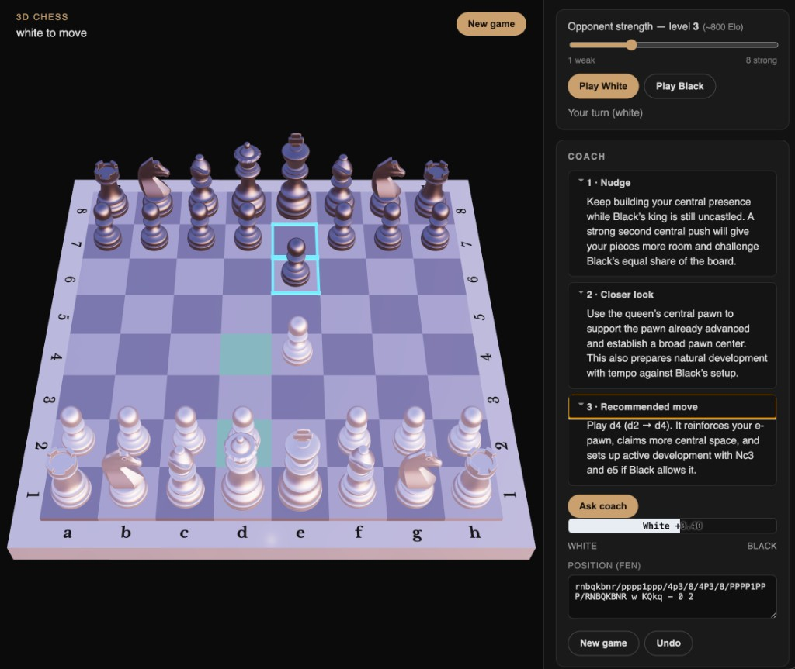

# Learn Chess

Local 3D chess with a Stockfish opponent and an LLM coach that gives progressive tips aligned to the engine’s best move.



## Requirements

- **Node.js** 20+ (npm)
- A machine that can run WebAssembly (Stockfish in the browser)

## Run

```bash
git clone git@github.com:protoEvangelion/learn-chess.git
cd learn-chess
npm install
npm run dev
```

Open the URL Vite prints (default [http://127.0.0.1:5173](http://127.0.0.1:5173)).

Optional:

```bash
npm run dev -- --host 127.0.0.1 --port 5174
```

### Coach (optional)

`Ask coach` calls DeepSeek V4.1 Flash through Vercel AI Gateway. Link the
project to Vercel and run `vercel env pull .env.local` for local Gateway
authentication, or set `AI_GATEWAY_API_KEY`. Override the model with:

```bash
AI_COACH_MODEL=deepseek/deepseek-v4.1-flash npm run dev
```

Each game gets a `gameId` in the URL, and recent visible chat turns are sent
with follow-up questions so the stateless model can follow the conversation.

Production opening cards are curated ahead of time and stored in Turso;
DeepSeek is used only for live coaching. After deploying card changes, seed
the database with:

```bash
OPENING_CARD_BASE_URL=https://your-project.vercel.app npm run seed:opening-cards
```

Local development uses the Turso dev database (`TURSO_DATABASE_URL` and `TURSO_AUTH_TOKEN` in `.env.local`). Production uses a second database with the same variable names. Vercel Preview should use the dev database.

## Features

- 3D board with move animations, capture bursts, and SFX
- Board / piece / room themes (Settings) with curated offline assets
- Play as White or Black vs Stockfish (strength 1–8)
- Eval bar, material imbalance, check highlight, last-move glow
- Progressive coach tips (nudge → closer look → full move) tied to Stockfish
- Position in the URL (`fen` + `gameId`); **Undo** is browser back

## Assets

Curated themes live under `public/assets/` (boards, pieces, rooms) and `public/sfx/`. Regenerate generated GLBs/SFX with:

```bash
node scripts/generate-assets.mjs
node scripts/generate-assets.mjs --sfx-only   # quiet CC0 wood taps only
```

| Theme | Notes |
|-------|--------|
| Classic board / Metal pieces | From [joshwrn/3d-chess](https://github.com/joshwrn/3d-chess) |
| Walnut board | Project-generated GLB (CC0) |
| Retro PC board + pieces | [Sketchfab](https://sketchfab.com/3d-models/retropc-chess-31e657b251b546e69e6ae312fc0bf66a) (split) |
| Glass board + pieces | [Al / chess-board](https://sketchfab.com/3d-models/chess-board-a0d61768bc504082901728ec9603fa0d) CC-BY (split) |
| Dining room | [Modern dining room](https://sketchfab.com/3d-models/modern-dining-room-df3f3c9f6233447eb8b7ee129f3bace5) |
| Realistic room | [Realistic room](https://sketchfab.com/3d-models/realistic-room-7b65ce7710b442d9932440d5b9812287) |
| Dawn HDR | Existing IBL preset |

When adding Sketchfab models: download a redistributable license (CC-BY/CC0), normalize origins (see `scripts/split-*.mjs`), drop into `public/assets/...`, and register in `src/lib/themes.ts`.

## Credits

- **3D chessboard, pieces, and core board logic** adapted from [joshwrn/3d-chess](https://github.com/joshwrn/3d-chess) by [joshwrn](https://github.com/joshwrn)
- **Stockfish** via the lite WASM build in `public/engines/`
- **chess.js** for FEN helpers and SAN labeling for the coach
- **Retro PC chess** — [Sketchfab](https://sketchfab.com/3d-models/retropc-chess-31e657b251b546e69e6ae312fc0bf66a)
- **Modern dining room** — [Sketchfab](https://sketchfab.com/3d-models/modern-dining-room-df3f3c9f6233447eb8b7ee129f3bace5)
- **Realistic room** — [Sketchfab](https://sketchfab.com/3d-models/realistic-room-7b65ce7710b442d9932440d5b9812287)
- **Qwantani noon HDR** — [Poly Haven](https://polyhaven.com/a/qwantani_noon) (CC0)
- **Glass chess board + pieces** — [Al (@lightningocelot)](https://sketchfab.com/3d-models/chess-board-a0d61768bc504082901728ec9603fa0d) (CC-BY)

## License

See upstream [joshwrn/3d-chess](https://github.com/joshwrn/3d-chess) for original board asset licensing; this project’s app code is provided as-is for learning use. Project-generated GLBs/SFX are CC0 (soft board taps in `public/sfx/`). Sketchfab assets retain their listed licenses (credit required for CC-BY).
