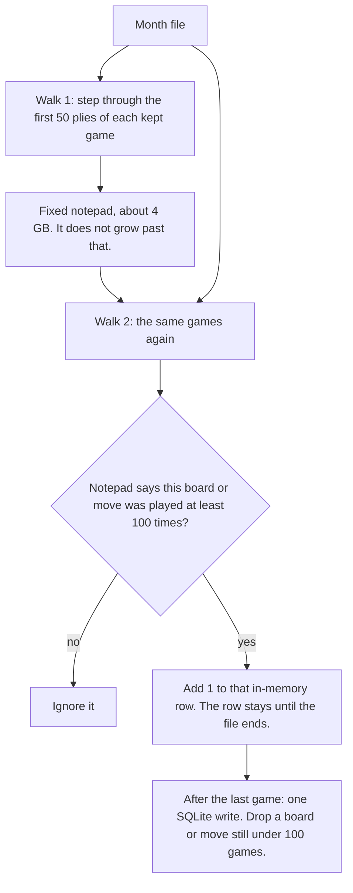

# Explorer database

Vercel queries two Turso aggregation tables, designed for win rate by board, speed, and rating band, and filled once from a month of Lichess games.

The game file is only needed while the counts are built. Download it, fill Turso, delete it. One month is about 30 GB. This Cursor cloud machine has about 245 GB free, so that job fits here. The machine is temporary, so it is not a place to keep the file. Keep the file on the Mac Mini only if you want it there for the next month.

## Why two tables

`explorer_move` answers: from this board, which replies were played, and how did those games end? `san` is the reply, such as `e5`. `white`, `draws`, and `black` are how those games ended.

`explorer_position` answers: how many games reached this board at all? The same three counts, for everyone who reached the board, including replies we hid.

Moves played under 100 times this month are left off `explorer_move`. Those games still reached the board, so the reply rows add up to less than the position row. After 1. e4, 1,000 games reached the board, 600 played e5, 300 played c5, and 100 played rare replies we do not list. The position row keeps the 1,000.

## What a row is

A row is one bucket: this month, this speed (blitz, rapid, or classical), this rating band, this board. It holds three numbers: white wins, draws, black wins.

`explorer_position` — games that reached the board. One row per bucket that reached it at least 100 times.

`explorer_move` — games that played one move from that board. Same bucket, plus the move (`e4`). One row per bucket that is not zero. The move is kept only if it was played at least 100 times this month, adding every speed and band together.

The next month is more rows with a new `month`. The click adds months together. No new columns.

## Columns and ids

There is no separate id number. The id is the columns that make a row unique.

`position` is the FEN with the two clock numbers removed, so two move orders that reach the same pieces share a row.

`explorer_position`

| Column | Example | Meaning |
| --- | --- | --- |
| `month` | `2026-09` | which file the row came from |
| `speed` | `blitz` | `blitz`, `rapid`, or `classical` |
| `rating_band` | `1600` | `0`, `1000`, `1200`, `1400`, `1600`, `1800`, `2000`, `2200`, `2500` |
| `position` | the board | FEN without the clock numbers |
| `white`, `draws`, `black` | `120, 40, 90` | games that reached this board and ended that way |

Id: `month`, `speed`, `rating_band`, `position`.

`explorer_move`

| Column | Example | Meaning |
| --- | --- | --- |
| `month`, `speed`, `rating_band`, `position` | same as above | the same bucket |
| `uci` | `e2e4` | the move, used in the id |
| `san` | `e4` | the same move, shown on the page |
| `white`, `draws`, `black` | `80, 20, 40` | games that played this move and ended that way |

Id: `month`, `speed`, `rating_band`, `position`, `uci`.

Lookup index on both tables: `position`, `rating_band`, `speed`, `month`. A click looks up one board.

## How a click queries

The page sends the board and the rating bands you picked. Vercel adds the matching rows and sorts by the side to move’s win rate (wins divided by games). Draws stay in the game count.

```sql
SELECT san,
       SUM(white) AS white,
       SUM(draws) AS draws,
       SUM(black) AS black
FROM explorer_move
WHERE position = ?
  AND rating_band IN ('1600')
  AND speed IN ('blitz', 'rapid', 'classical')
GROUP BY san
```

The board total is the same filter on `explorer_position`, summed. The lookup uses an index on the board, so it reads that board’s rows only.

## Cost

Clicks fit on the free plans. Loading the month might not.

Vercel Hobby is $0. It includes 1 million function calls a month. One click is one call.

Turso Free is $0: 5 GB storage, 500 million rows read a month, 10 million rows written a month. These are shared with the tables we already have. Past any one limit, Turso blocks the database. The free plan does not bill the extra.

A click reads tens or hundreds of rows. Half a billion reads is far more clicks than this app will see.

The load writes every row, and each index counts as another write. A likely load is a few million rows. The ceiling is low tens of millions. That can fit in 5 GB and 10 million writes, or it can pass the write cap. If it does, Developer is $5.99 a month ($4.99 billed yearly): 9 GB and 25 million writes.

Check the row count after the first load. Stay on free if it fits. Move to Developer only if the load hits the cap.

## Build the tables locally

Run the full month on the local machine. Do not download the 27 GB game file onto a cloud machine. The slice test below is the job that runs in the cloud.

1. Download the newest standard rated month from https://database.lichess.org/standard/. Use the `.pgn.zst` file, such as `lichess_db_standard_rated_2026-09.pgn.zst`. Do not use the `.torrent`. Stream the `.pgn.zst`. Do not unzip a second full copy.
2. Count into a scratch SQLite file on that machine. Then copy the kept rows to Turso. Delete the game file and the scratch file when the copy finishes.
3. Turso connection: `TURSO_DATABASE_URL` and `TURSO_AUTH_TOKEN` (same as `server/turso.ts`). Point those at the prod database for this load. A monthly load into the dev database shares the free-tier write cap and can block both databases. Batch the inserts.

Keep a game when it is standard, rated, has both ratings, has a result, and neither player is a bot. Skip bullet, ultrabullet, and correspondence.

Speed comes from the clock. `total = initial seconds + 40 * increment`. Blitz is 180 up to 479. Rapid is 480 up to 1499. Classical is 1500 up to 21599. Anything else is skipped.

Rating band is the average of the two ratings. Bands are `0`, `1000`, `1200`, `1400`, `1600`, `1800`, `2000`, `2200`, `2500`. A band runs from its number up to the next band. `2500` is 2500 and above.

## How a month is counted

The file is read twice. Walk 1 only marks which boards and moves were popular. Walk 2 counts those. The in-memory table on walk 2 has no entry cap. It keeps every popular row until the file ends. SQLite is written once, after the last game.



One ply is one player’s move. 50 plies is 25 moves by White and 25 by Black. The rest of the game is not recorded. The game’s result still counts: if White eventually won, that win is what gets added, even though we stopped stepping at ply 50.

```text
1. e4     ply 1    count the start board, and count e4
1... c5   ply 2    count the board after e4, and count c5
...
25. Nf3   ply 49
25... Be7 ply 50   count that move, then count the board it landed on
26. anything       stop. this move is not stored
```

`position` is the first four FEN fields, the same key as `positionKey` in `server/openingBook.ts`. For each ply, add 1 to that board’s white, draw, or black count, and add 1 to the move that was just played. `san` is the written move. `uci` is from-square, to-square, and promotion piece if any. `month` is the file’s month, such as `2026-09`.

After the file, keep a move whose games add up to at least 100 across every speed and band. Keep a board the same way. Then write every speed and band cell that is not zero, even when that one cell is small. Replacing a month is `DELETE FROM ... WHERE month = ?` on both tables, then insert that file again.

```sql
CREATE TABLE explorer_position (
  month TEXT NOT NULL,
  speed TEXT NOT NULL,
  rating_band TEXT NOT NULL,
  position TEXT NOT NULL,
  white INTEGER NOT NULL,
  draws INTEGER NOT NULL,
  black INTEGER NOT NULL,
  PRIMARY KEY (month, speed, rating_band, position)
);
CREATE INDEX explorer_position_lookup
  ON explorer_position (position, rating_band, speed, month);

CREATE TABLE explorer_move (
  month TEXT NOT NULL,
  speed TEXT NOT NULL,
  rating_band TEXT NOT NULL,
  position TEXT NOT NULL,
  uci TEXT NOT NULL,
  san TEXT NOT NULL,
  white INTEGER NOT NULL,
  draws INTEGER NOT NULL,
  black INTEGER NOT NULL,
  PRIMARY KEY (month, speed, rating_band, position, uci)
);
CREATE INDEX explorer_move_lookup
  ON explorer_move (position, rating_band, speed, month);
```

## Query

The page sends the current board and the selected rating bands. Sum the rows. Do not filter `month`, so the next month is included automatically. Sort White to move by `white / (white + draws + black)`. Sort Black to move by `black / (white + draws + black)`.

```sql
SELECT uci, san,
       SUM(white) AS white,
       SUM(draws) AS draws,
       SUM(black) AS black
FROM explorer_move
WHERE position = ?
  AND rating_band IN ('1600')
  AND speed IN ('blitz', 'rapid', 'classical')
GROUP BY uci, san
```

```sql
SELECT SUM(white) AS white,
       SUM(draws) AS draws,
       SUM(black) AS black
FROM explorer_position
WHERE position = ?
  AND rating_band IN ('1600')
  AND speed IN ('blitz', 'rapid', 'classical')
```

The move query is the reply list. The position query is the board total. To get the next level, play the chosen `uci` on the board and run the same queries with the new `position`.

## Reply names

Do not store names in these tables, and do not call the Lichess explorer API to get them. Names do not change with rating band or month.

The names already come from Lichess’s opening book, loaded by `server/openingBook.ts` from `lichess-org/chess-openings`. After the move query, name a reply from the moves played so far, including that reply. Use the longest book line whose move list is a prefix of those moves. If none match, leave the name empty. The page already hides a name that repeats its parent.

## Test the faster walk

The row layout to implement is `docs/explorer-fast-count.md`. The current `explorer-rs` walk 2 is the string-key map. Replace that map. Leave the Mac’s full-month process alone, and do not point a test at `.data`.

The fixture is `fixtures/lichess-2026-09-slice.pgn` (98,997,894 bytes, 42,050 games). It is the start of the September 2026 standard rated dump, cut on a game boundary. It mixes blitz, rapid, classical, and bullet. Bullet is still skipped. 42,050 games do not fill the board map, so a fast time on this file does not prove the 2-hour goal. Use it to check counts. Use the bench below to check speed.

Correctness:

```bash
cargo run --release --manifest-path explorer-rs/Cargo.toml -- \
  --pass all \
  --file fixtures/lichess-2026-09-slice.pgn \
  --data fixtures/slice-string \
  --threshold 1

cargo run --release --manifest-path explorer-rs/Cargo.toml -- \
  --pass all \
  --file fixtures/lichess-2026-09-slice.pgn \
  --data fixtures/slice-fast \
  --threshold 1
```

`--threshold 1` is only for this fixture, so a short file still emits rows. The month build stays at 100. The two scratch databases must agree on `SUM(white + draws + black)` for `explorer_position` and for `explorer_move`. Also compare the starting board and the board after 1. e4, per speed and band. Do not upload the fixture to Turso.

Speed:

A full month is 89,616,462 games. Both walks together must finish in 2 hours or less. Walk 1 already does that file in about 11 minutes. Walk 2 has to hold at least 15,000 games a second after the map is already large.

Add `--pass bench`. It does not read the PGN. Fill the compact position map with 2,000,000 distinct boards (synthetic board text of about 70 bytes is fine), then apply 40,000,000 updates. About 90% of those updates hit boards already in the map. Print updates per second and the process RSS.

One kept game is about 50 position updates and 50 move updates. 15,000 games a second is 1,500,000 cell updates a second. The bench passes when those 40,000,000 updates finish above 750,000 updates a second and RSS stays under 4 GB. Run the same fill against the old string-key map as a control. The compact map has to beat that control at 2,000,000 boards. If both finish above the line, the bench is too small and does not count.

```bash
cargo run --release --manifest-path explorer-rs/Cargo.toml -- --pass bench
```
