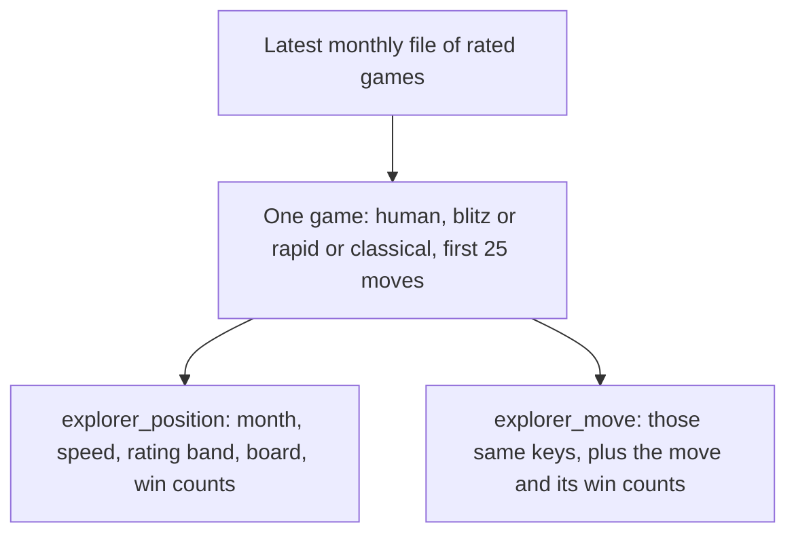
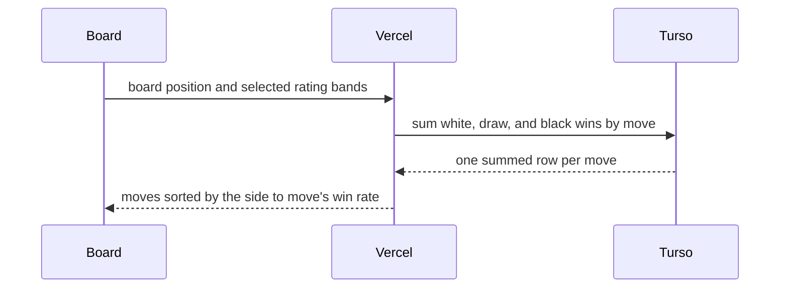
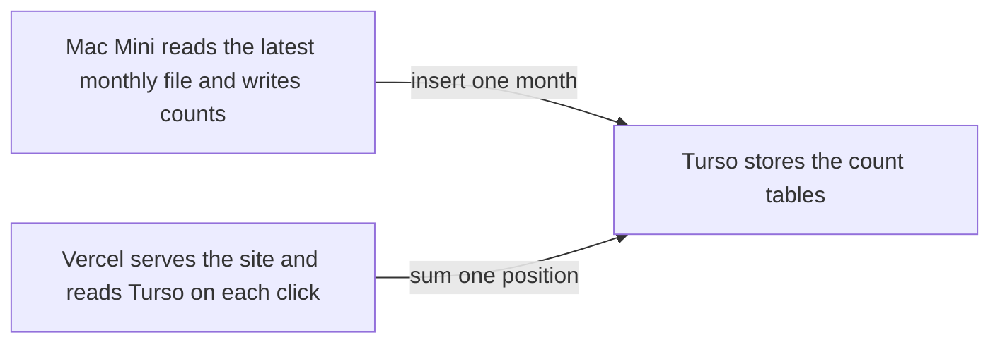

# Explorer database

We store counted results, not games. For one board, one speed, and one rating band, a row says how many games reached that board and how they ended. A second table says the same thing for each move played from that board.

Start with the latest Lichess monthly file only. One file is about 90 million rated games, which is enough to list the moves people play and to sort those moves by win rate. Older months are the same kind of row. A `month` column lets the next file be an insert. The click query adds the months together. The columns stay as they are.

The counts are built on a Mac Mini from that file. The site on Vercel reads the counts from Turso.

## What we keep from a game

Each game adds 1 to a few counters (an aggregate):

- Standard rated games. Skip a game when either player is a bot.
- Speeds we show today: blitz, rapid, and classical. Each game is one speed.
- The first 50 plies only (25 moves a side).
- The rating band is the average of the two players, using the bands the Explore tab already has: `0`, `1000`, `1200`, `1400`, `1600`, `1800`, `2000`, `2200`, `2500`. Each band runs from its number up to the next. One game lands in one band.
- The board id is the FEN with the two clock numbers removed. Two move orders that reach the same pieces share a row (a transposition).

The 1 is the game's final result: white win, draw, or black win. Reaching a board updates that board's counters. Playing a move updates that move's counters.

## Cutoff

Keep a move when players played it in **at least 100 games in that month**. Add blitz, rapid, and classical, and all rating bands, before applying that test.

100 is a storage rule. The old "above 30" figure was a way to stop a long API walk. This build reads one file locally, so the limit is there to make the win-rate sort calm. On 30 games, one result moves the rate by about three points. On 100 games, one result moves it by one point. A move that appears 100 times in the latest month is a move people are playing now.

The band and speed split is still stored for every kept move. A thin band stays in the table. The page adds whichever bands the user selected. Asking for 100 games inside every band would hide classical and the 2500 band.

The start position is always stored. Boards past ply 50 are not stored. Moves under 100 games in that month are not stored. A cell with zero games is left out.

The board total can be higher than the sum of the listed moves, because rare next moves still count as games that reached the board.

## Tables

`explorer_position` — games that reached this board.

| Column | Meaning |
| --- | --- |
| `month` | `2026-09`, from the file name |
| `speed` | `blitz`, `rapid`, or `classical` |
| `rating_band` | `1600`, or one of the other eight ids |
| `position` | FEN with the clock numbers removed |
| `white`, `draws`, `black` | games that reached this board and ended that way |

Primary key: `month, speed, rating_band, position`.

`explorer_move` — games that played this move from this board.

| Column | Meaning |
| --- | --- |
| `month`, `speed`, `rating_band`, `position` | same meaning as above |
| `uci` | the move, such as `e2e4` |
| `san` | the move, such as `e4` |
| `white`, `draws`, `black` | games that played this move and ended that way |

Primary key: `month, speed, rating_band, position, uci`.

Lookup index: `position, rating_band, speed, month`. A click looks up one board. The index keeps that read short.

Speed and band are their own columns for the same reason `month` is. The page adds the three speeds today. A later "blitz only" switch is a filter on the same rows.

Adding a month inserts rows with a new `month`. Replacing a month deletes `WHERE month = ?` and inserts that file again.

`explorer_branches` stays the 7-day cache it already is. These two tables sit beside it. The Sunday delete names only `explorer_branches`.



## How one click is a query

The board already knows the position. The browser sends that position and the selected rating bands to the site. The site asks Turso to add up the matching rows. The page sorts the list it gets back. White to move sorts by white wins divided by games. Black to move sorts by black wins divided by games. A draw stays in the game count and counts for neither side.

Moves from this board:

```sql
SELECT uci, san,
       SUM(white) AS white,
       SUM(draws) AS draws,
       SUM(black) AS black
FROM explorer_move
WHERE position = ?
  AND rating_band IN ('1600')
  AND speed IN ('blitz', 'rapid', 'classical')
GROUP BY uci, san
```

Games at this board:

```sql
SELECT SUM(white + draws + black) AS games
FROM explorer_position
WHERE position = ?
  AND rating_band IN ('1600')
  AND speed IN ('blitz', 'rapid', 'classical')
```

Leave `month` out of the filter. With one month loaded, the sum is that month. After the next month is inserted, the same query includes it. A single-month view later is `AND month = '2026-09'`.

An empty move list means the move was under 100 games, or the board is past ply 50. The tree ends there.

Opening names stay in the opening book the app already ships. These tables store counts.



## Where each piece runs

| Piece | Where | Job |
| --- | --- | --- |
| Monthly file | Mac Mini | Download the latest file from database.lichess.org, stream it, write the count rows into Turso |
| Count tables | Turso | Hold `explorer_position` and `explorer_move` |
| Website | Vercel, https://learn-chess-fawn.vercel.app | On each Explore click, read Turso and return the summed moves |

The Mac Mini streams the compressed file while it counts, so the unpacked games do not have to sit on disk as a second full copy. The Cursor cloud disk is temporary. The file and the database do not live there.

The site already opens Turso with `TURSO_DATABASE_URL` and the auth token, in `server/turso.ts`. The Explore read uses that same client. The browser never sees the token.

Turso is the right store for these count tables: one click is a short indexed read, and the app is already connected. The monthly game file itself stays on the Mac Mini.

## Count tables are the reduced form

[Aix](https://thomasd.be/2026/02/01/aix-storing-querying-chess-games.html) packs a month of whole games into about 12–15 GB and lets you ask new questions in SQL. One question over that file takes about a minute and a half on a large machine. Explore needs an answer on the click, so the site does not query the games.

These two tables are that file reduced to the one question we ask: from this board, with these rating bands, how did each move end? Each rating band stays its own rows, because the page adds whichever bands you pick. We do not prebuild every combination of bands. Speeds stay separate so a later “blitz only” filter is the same table.

Aix can be the scanner on the Mac Mini if that month’s file is available. The scan still writes these same rows into Turso. The official monthly file remains the input when it is not.

```mermaid
flowchart LR
  games["Month of games, PGN or Aix"]
  counts["Count tables, one row per band and move"]
  click["Click adds the selected bands"]
  games -->|"once, on the Mac Mini"| counts -->|"each click, from Turso"| click
```


